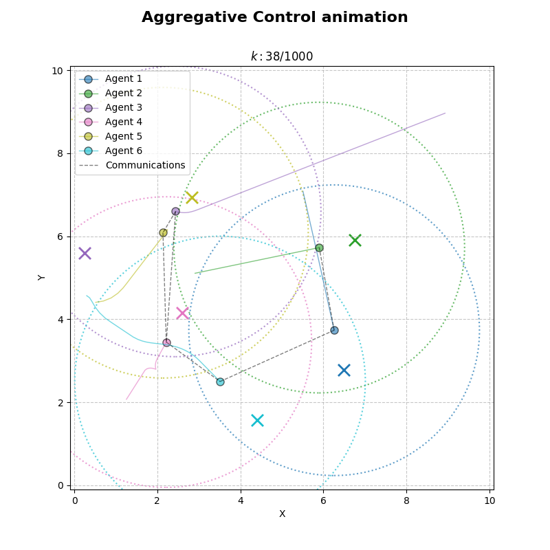
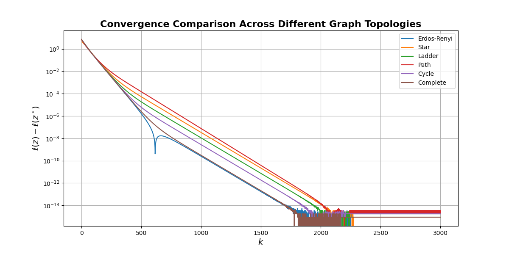
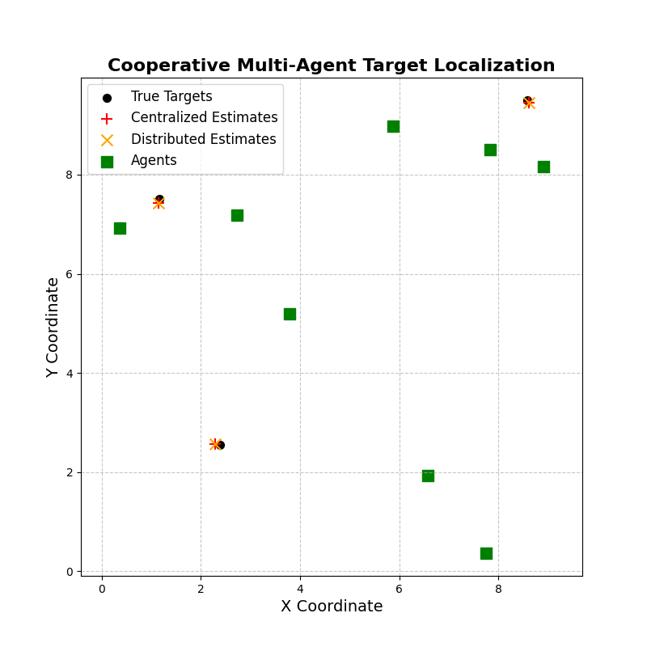
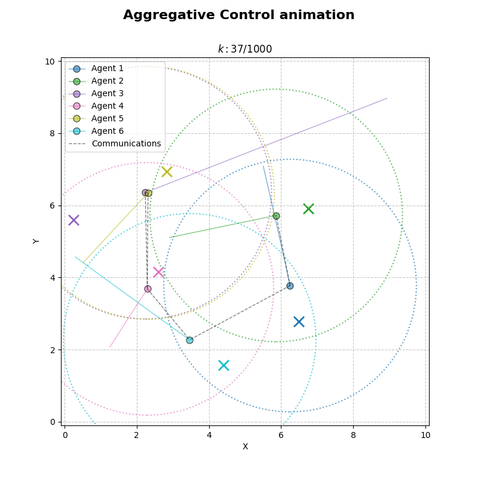
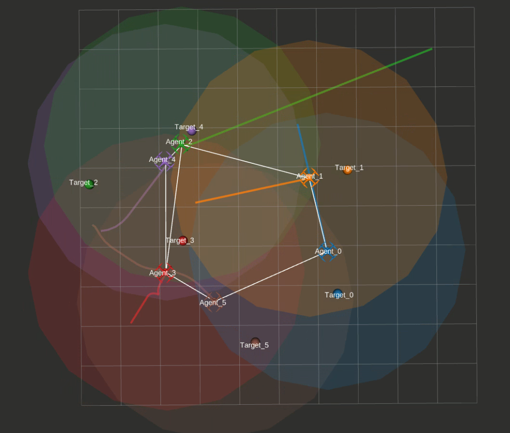

# DAS — Distributed Multi-Robot Optimization

Python and ROS 2 implementation of distributed optimization algorithms for multi-robot coordination, developed as the final project of the *Distributed Autonomous Systems* course at the University of Bologna. The repository covers four tasks of increasing complexity: distributed consensus optimization via Gradient Tracking, cooperative multi-robot target localization, distributed Aggregative Optimization with optional collision avoidance, and a ROS 2 implementation of the aggregative algorithm with RViz visualization.

All algorithms are validated in simulation. No deployment on physical hardware.



## Context

Course project for *Distributed Autonomous Systems*, M.Sc. in Automation Engineering, University of Bologna, A.A. 2024/25. Course held by Prof. Notarstefano. Project completed between April and June 2025.

The four tasks follow the structure of the official assignment:

- **Task 1.1**: Distributed Consensus Optimization via Gradient Tracking (Python)
- **Task 1.2**: Cooperative Multi-Robot Target Localization (Python)
- **Task 2.1**: Distributed Aggregative Optimization, with and without collision avoidance (Python)
- **Task 2.2**: ROS 2 implementation of Task 2.1 with RViz visualization

Collision avoidance in Task 2.1 is an extension beyond the official assignment, implemented as a penalty term in the local cost function.

## Repository structure

```
das-multi-robot-optimization/
├── python_tasks/                        # Tasks 1.1, 1.2, 2.1 (Python)
│   ├── main.py                          # Single entry point with task-selection flags
│   ├── functions.py                     # Graph generation, algorithms
│   ├── plots.py                         # Visualization
│   └── config.py                        # Shared parameters
├── task_2_2_ros2_aggregative/           # Task 2.2 (ROS 2)
│   └── aggregative_control/             # ROS 2 package (copy to ros2_ws/src/ to build)
│       ├── aggregative_control/         # Agent, visualizer, supervisor nodes
│       ├── launch_folder/               # aggregative_launch.py, vis_launch.py
│       └── ...
├── docs/
│   ├── report.pdf                       # Full project report
│   └── images/                          # Hero plots used in this README
├── .gitignore
└── README.md
```

## Task 1.1 — Distributed Consensus Optimization

Implementation of the Gradient Tracking algorithm to solve a consensus optimization problem of the form

$$\min_z \sum_{i=1}^N \ell_i(z)$$

with quadratic local cost functions and decision vector $z \in \mathbb{R}^2$. The algorithm is evaluated on six different graph topologies, with mixing weights computed via the Metropolis-Hastings rule:

- Erdős-Rényi (probabilistic)
- Star
- Ladder
- Path
- Cycle
- Complete

For each topology the code plots the evolution of the global cost and of the gradient norm on a semi-logarithmic scale.



## Task 1.2 — Cooperative Multi-Robot Target Localization

The Gradient Tracking algorithm of Task 1.1 is extended to a cooperative target localization scenario. A team of 8 agents observes 3 unknown targets through noisy distance measurements and cooperatively estimates the target positions by minimizing

$$\ell_i(z) := \sum_{\tau=1}^{N_T} \left( d_{i\tau}^2 - \|z_\tau - p_i\|^2 \right)^2$$

A centralized baseline (full-information gradient descent) is implemented for comparison. The distributed solution converges to estimates close to the centralized baseline using only local communication.



## Task 2.1 — Distributed Aggregative Optimization

Implementation of the Aggregative Tracking algorithm for a team of 6 agents that must move toward private targets while keeping the fleet cohesive. The global aggregative variable $\sigma(z)$ corresponds to the team barycenter. Each agent maintains local proxies for $\sigma(z)$ and for the aggregated gradient and updates them via consensus over a time-varying communication graph.

Two variants are implemented:

- **Without collision avoidance**: baseline aggregative tracking as specified in the assignment.
- **With collision avoidance** (extension beyond the assignment): an inter-agent repulsion term is added to the local cost as a penalty proportional to $\max(0, \delta - \|z_i - z_j\|)^2$ for neighboring agents within a safety distance $\delta$. The communication graph is rebuilt at each iteration based on proximity, yielding a time-varying topology.

| Without collision avoidance | With collision avoidance |
|:---:|:---:|
|  |  |

## Task 2.2 — ROS 2 Implementation

The aggregative algorithm of Task 2.1 is reimplemented as a ROS 2 package, with each agent running as an independent node. A supervisor node manages neighbor computation at each iteration, synchronizes agent execution, and logs convergence metrics to a CSV file. A visualizer node reads the CSV after the simulation and publishes agent positions and trails to RViz via `visualization_msgs/Marker`.



Demo video: [▶ watch on YouTube](https://youtu.be/eVVtqJ8o3os?si=c_H3fGnPHzMhUTd_)
<!-- Replace with actual link once the RViz demo is uploaded. -->

## Dependencies

### Python tasks (1.1, 1.2, 2.1)

- Python 3.8+
- `numpy`
- `networkx`
- `matplotlib`

```bash
pip install numpy networkx matplotlib
```

### ROS 2 task (2.2)

- Ubuntu 22.04
- ROS 2 Humble
- Python 3.10 (default with ROS 2 Humble)
- Python packages: `numpy`, `pandas`, `matplotlib`
- ROS 2 packages: `rclpy`, `std_msgs`, `visualization_msgs`, `geometry_msgs`, `tf2_ros`, `rviz2`

```bash
pip install numpy pandas matplotlib
sudo apt install ros-humble-rviz2 ros-humble-tf2-ros xterm
```

## How to run

### Python tasks (1.1, 1.2, 2.1)

All Python tasks share a single entry point in `python_tasks/main.py`. Task selection is done by setting boolean flags at the top of the file. This was a deliberate design choice to keep the shared infrastructure (graph generation, Metropolis-Hastings weights, plotting) in one place across tasks.

```python
# python_tasks/main.py
TASK1_1 = True             # enable Task 1.1
TASK1_2 = False            # enable Task 1.2
TASK2_1 = False            # enable Task 2.1
AVOIDANCE_2_1 = True       # True: with collision avoidance / False: without
GRAPH_1_2 = "Cycle"        # graph topology for Task 1.2
                           # options: "Erdos-Renyi", "Star", "Ladder", "Path", "Cycle", "Complete"
```

After editing the flags:

```bash
cd python_tasks
python3 main.py
```

Plots and animations are displayed via matplotlib at the end of each run.

### ROS 2 task (2.2)

Copy the ROS 2 package into a workspace and build. Run the following from the repository root (adjust the workspace path if needed):

```bash
mkdir -p ~/ros2_ws/src
cp -r task_2_2_ros2_aggregative/aggregative_control ~/ros2_ws/src/
cd ~/ros2_ws
colcon build --packages-select aggregative_control
source install/setup.bash
```

Run the simulation (Terminal 1):

```bash
ros2 launch aggregative_control aggregative_launch.py
```

Each agent node opens in a separate `xterm` window. The supervisor writes `agent_data_log.csv` and `target_positions.txt` to the current working directory. After the simulation completes, copy them to the package share directory:

```bash
DATA_DIR=$(ros2 pkg prefix aggregative_control)/share/aggregative_control/data
cp agent_data_log.csv target_positions.txt "$DATA_DIR/"
```

Launch the RViz visualization (Terminal 2):

```bash
ros2 launch aggregative_control vis_launch.py
```

Cost and gradient plots are generated first; after closing them, the RViz animation starts.

> **Note:** Sample output files are already included in `task_2_2_ros2_aggregative/aggregative_control/data/`. To run the visualization with pre-computed results, skip the simulation step and run `vis_launch.py` directly after building.

## Algorithms

The algorithms implemented in this repository follow the formulations in the course material. Brief notes:

- **Gradient Tracking** (Tasks 1.1, 1.2): each agent maintains a local estimate $z_i$ and a local gradient tracker $s_i$, updated via consensus over the communication graph with Metropolis-Hastings weights.
- **Aggregative Tracking** (Tasks 2.1, 2.2): in addition to the local decision $z_i$, each agent maintains two consensus proxies: one tracking the global aggregative variable $\sigma(z)$ (the barycenter), and one tracking the aggregated gradient term. This allows fully distributed coordination without exchanging individual positions globally.
- **Collision avoidance variant** (Task 2.1 extension): an inter-agent penalty is added to the local cost. Communication links are rebuilt at each iteration based on a proximity threshold, producing a time-varying graph. This is a penalty-based formulation, not a formal control barrier function.

The full mathematical derivation and convergence plots are in `docs/report.pdf`.

## Limitations and known issues

- All experiments are conducted in simulation (Python/matplotlib for Tasks 1.1–2.1, Gazebo-free ROS 2 with RViz for Task 2.2). No deployment on physical robots.
- Collision avoidance is implemented as a soft penalty term, not as a formal safety guarantee. With aggressive step sizes or tight safety distances, transient violations of the safety distance can occur.
- The ROS 2 implementation runs all agent nodes on a single machine. Network latency, packet loss, and asynchronous communication effects are not modeled.
- Step sizes and penalty weights are hand-tuned for the scenarios reported. The implementation does not include adaptive tuning.
- The Python `main.py` uses module-level flags rather than CLI arguments. Switching between tasks requires editing the file. This was a deliberate trade-off given the shared infrastructure across tasks.

## Team and Contributions

- Brando Ulissi
- Niccolò Antolini
- Daniele Crivellari

## License

MIT. See [`LICENSE`](LICENSE).
